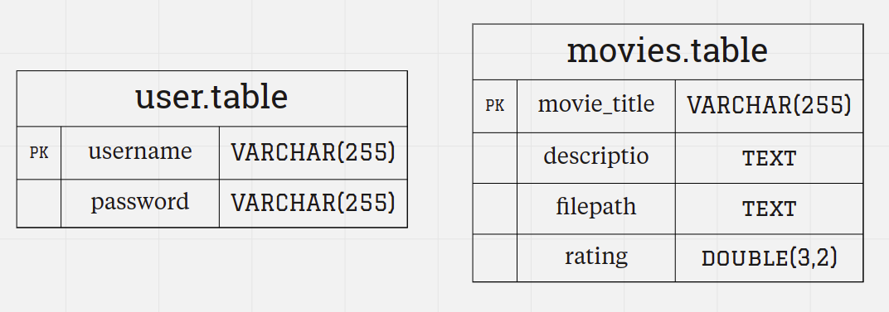

# Introduction:
This is a simple website for Movies. The website allows authorized
users to add new movies and delete the old ones if needed. The
website uses MySQL as a database provider to manipulate data and
allow the users to add movies with the title, brief descriptions,
thumbnails photos, and rating of the movie.
## Directory Structure:
The project has a standard structure of laravel framework 8 .x with
some customization just to make it simple.
* The app/Http/Controllers directory </br>
The directory contains controllers to handle requests
entering the project.
* The database/migrations directory </br>
The directory contains database migration scripts for
schema database tables. The migrations scripts also has
some data for demo Purposes.
* The public directory </br>
The directory contains the index.php file, which is the entry
point for all requests entering the project and configures
autoloading. This directory also houses the assets such as
images, JavaScript, and CSS.
* The public/images directory </br>
The directory contains movies thumbnails that have been
uploaded and the file path will be added to the database.* The resources directory
The directory contains the views as well as the raw,
un-compiled assets such as SCSS or JavaScript. This directory
also houses all development-stage files.
* The routes directory </br>
The routes directory contains all of the route definitions for
the project.
* The package.json file </br>
The file contains all npm scripts and Dependencies.
* The webpack.mix.js file </br>
The file contains all mix API configurations.
## ERD Diagrams :



## Basic Directory Structure:
```
.
|
|__app
|	|__Http
|		|__Controllers
|__database
|	|__migrations
|__public
|	|__images
|__resources
|__routes
|__package.json
|__webpack.mix.js

```